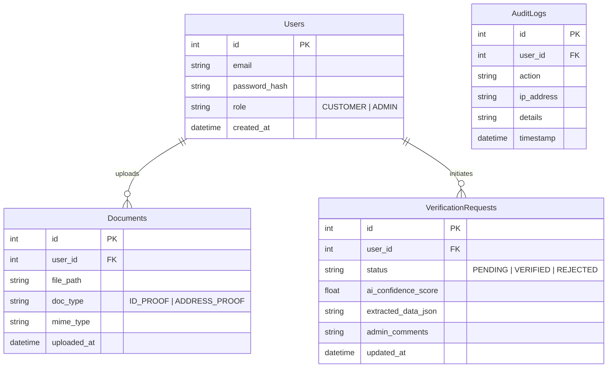

# Database Design Document
**Project:** Banking KYC Verification System

## 1. ER Diagram

## 2. Table Definitions

### 2.1 Users
Stores authentication and profile info.
- `id`: Serial Primary Key
- `email`: Unique, Indexed
- `role`: Enum ('CUSTOMER', 'ADMIN')

### 2.2 Documents
Stores references to uploaded files.
- `file_path`: Local path or S3 URL.
- `doc_type`: Type of document for categorization.

### 2.3 VerificationRequests
The core state machine for the KYC process.
- `status`: Drives the UI/UX.
- `extracted_data_json`: JSON blob storing OCR results for flexibility.

### 2.4 AuditLogs
Immutable record of all actions for compliance.
- `action`: e.g., "LOGIN", "UPLOAD_DOC", "VERIFY_DOC".
